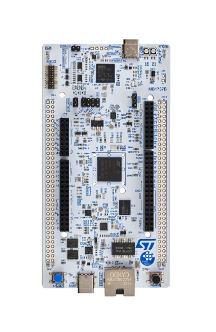
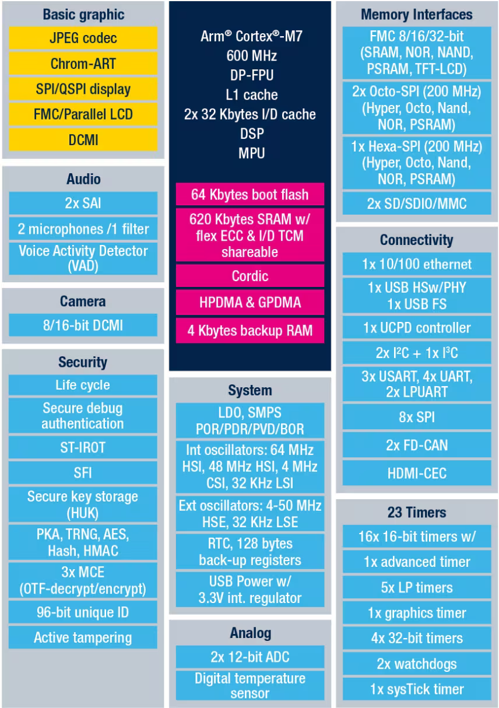

# NUCLEO-H7S3L8
Знакомство с STM32H7S3L8 на базе Development Board [NUCLEO-H7S3L8](https://www.st.com/en/evaluation-tools/nucleo-h7s3l8.html)

    

### [STM32H7S3L8](https://www.st.com/en/microcontrollers-microprocessors/stm32h7s3l8.html)

Устройства STM32H7Sxx8 основаны на высокопроизводительном 32-битном RISC-ядре Arm® Cortex®-M7, работающем на частоте до 600 МГц. Ядро Cortex-M7 оснащено блоком операций с плавающей запятой (FPU), который поддерживает команды и типы данных для двойной точности (соответствует стандарту IEEE 754) и одинарной точности Arm. Ядро Cortex-M7 включает 32 Кбайт кэша команд и 32 Кбайт кэша данных. Устройства STM32H7Sxx8 поддерживают полный набор DSP-инструкций и блок защиты памяти (MPU) для повышения безопасности приложений.

Устройства STM32H7Sxx8 содержат высокоскоростные встроенные памяти: 64 Кбайт пользовательской флеш-памяти, 128 Кбайт системной флеш-памяти и до 620 Кбайт ОЗУ (включая 128 Кбайт, которые могут быть распределены между ITCM и AXI, включая 64 Кбайт, выделенные исключительно для ITCM, включая 128 Кбайт DTCM, включая 64 Кбайт, выделенные исключительно для DTCM, включая 32 Кбайт AHB и 4 Кбайт резервной ОЗУ), а также широкий набор усовершенствованных портов ввода-вывода и периферийных устройств, подключенных к шинам APB, шинам AHB, двум 32-разрядным мульти-шинам AHB и многоуровневому соединению AXI, обеспечивающему доступ к внутренней и внешней памяти. Для повышения надежности приложений все памяти оснащены функцией коррекции ошибок с помощью кода ошибок (исправление одной ошибки, обнаружение двух ошибок).

Устройства включают периферийные модули для ускорения математических/арифметических функций (сопроцессор CORDIC для тригонометрических функций). Все устройства предлагают два АЦП, малопотребляющий RTC, 4 32-разрядных таймера общего назначения, 7 16-разрядных таймеров общего назначения (включая один ШИМ-таймер для управления двигателями), пять малопотребляющих таймеров, а также модуль криптографического ускорения (CRYP), ускоритель открытых ключей (PKA), защищенный сопроцессор AES (SAES) и модуль шифрования памяти (MCE). Устройства поддерживают один цифровой фильтр для внешних сигма-дельта модуляторов или цифровых микрофонов с обнаружением речевой активности. Они также оснащены стандартными и расширенными интерфейсами связи.

 

    

